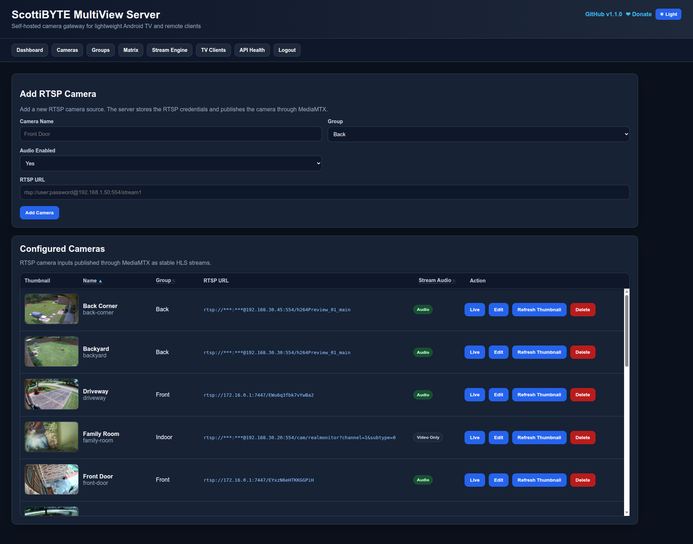
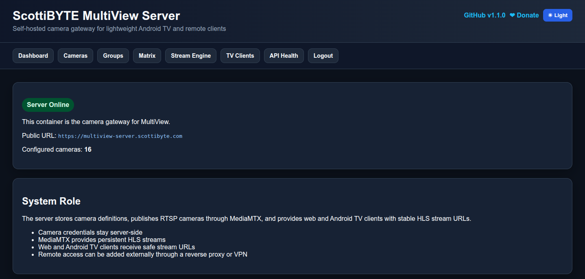
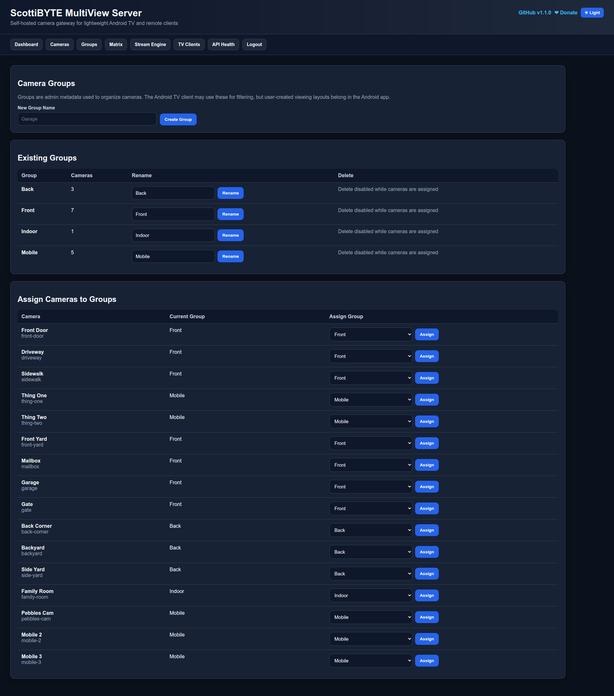
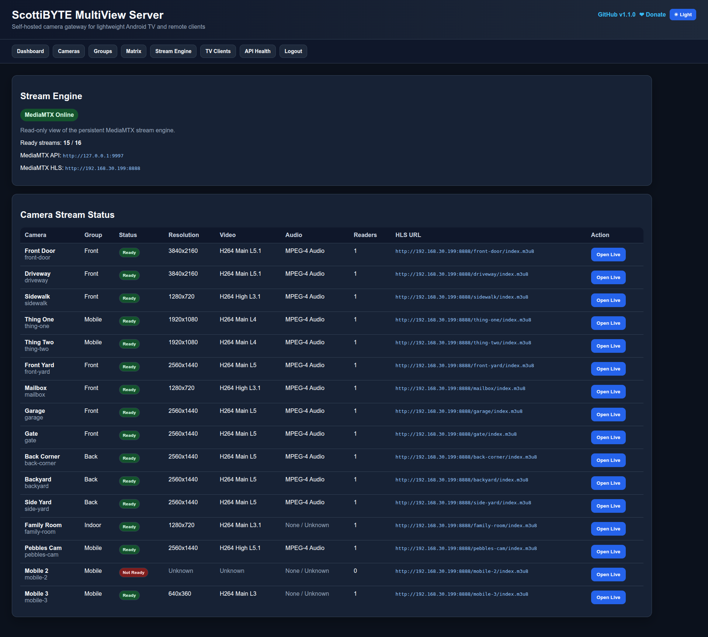
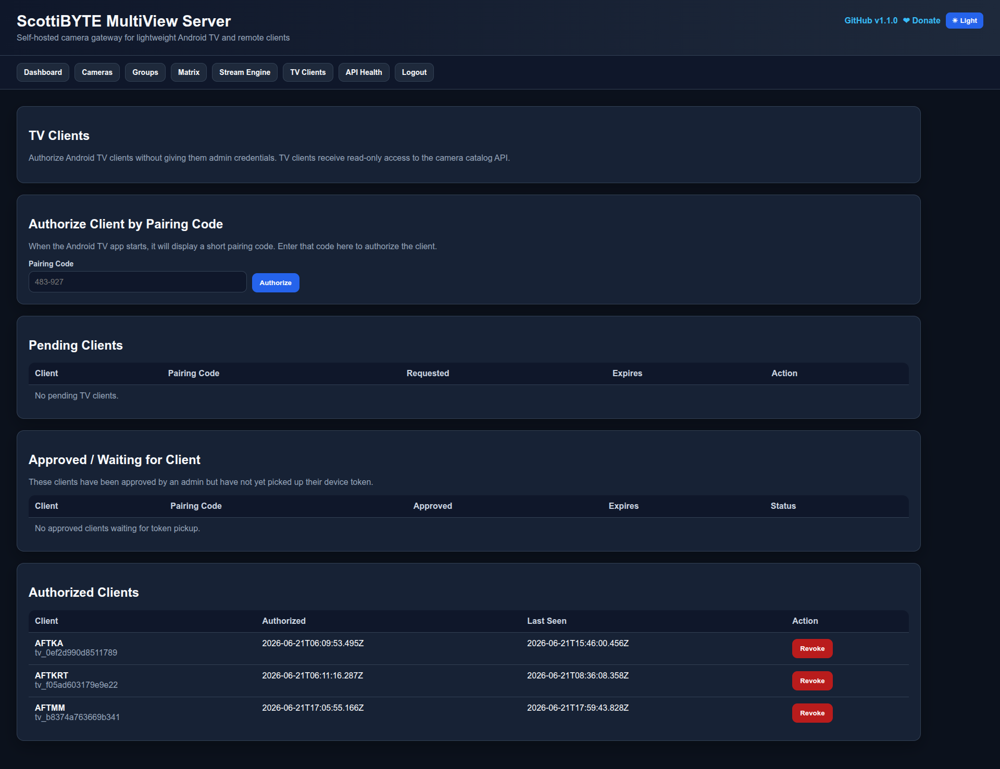

# ScottiBYTE MultiView Server

Self-hosted camera gateway for ScottiBYTE MultiView Android TV, Fire TV, phone, and tablet clients.

ScottiBYTE MultiView Server lets you define RTSP camera sources in a web interface, organize cameras into groups, publish TV-friendly HLS streams through MediaMTX, and securely pair ScottiBYTE MultiView clients without exposing camera usernames or passwords to client devices.



## Why MultiView Server Exists

Modern IP cameras commonly use high resolutions, high bitrates, and RTSP streams that are not always friendly to low-power Android TV devices or mobile devices. Trying to display many full-motion camera streams directly from cameras also exposes camera credentials and places unnecessary load on client devices.

ScottiBYTE MultiView uses a client/server architecture:

- The server stores all camera definitions and RTSP credentials.
- MediaMTX publishes secure HLS streams.
- Android TV, Fire TV, phone, and tablet clients securely pair with the server.
- Clients receive only the approved camera catalog and playback URLs.
- Camera credentials always remain on the server.

## Features

- Web-based camera configuration
- RTSP camera input support
- MediaMTX HLS stream publishing
- Camera groups
- Secure Remote Client pairing
- Remote Client management
- Rename authorized clients
- Remove pending authorization requests
- Read-only client camera catalog API
- Dashboard with server and stream status
- Stream Engine status
- Automatic thumbnail refresh
- Light and Dark themes
- Docker-friendly deployment

## Supported Clients

### ScottiBYTE MultiView Android TV / Fire TV

Designed for televisions and streaming devices.

Features include:

- Multiple simultaneous live cameras
- Full-screen viewing
- Remote-control navigation
- Drag-and-drop camera ordering
- Continuous monitoring

Repository:

https://github.com/ScottiBYTE/multiview-android-tv

---

### ScottiBYTE MultiView Mobile

Designed for Android phones and tablets.

Features include:

- Touch-first interface
- Camera thumbnails
- Inline live preview
- Full-screen player
- Pinch-to-zoom
- Swipe between cameras
- Custom camera ordering

Repository:

https://github.com/ScottiBYTE/multiview-android-mobile

## Screenshots

### Dashboard



### Cameras


### Groups



### Stream Engine



### Remote Clients



## Architecture

```
          RTSP Cameras
                │
                ▼
     ScottiBYTE MultiView Server
                │
                │  HLS via MediaMTX
                ▼
 ┌─────────────────────────────────────┐
 │ Android TV / Fire TV Client         │
 │ Android Phone Client                │
 │ Android Tablet Client               │
 └─────────────────────────────────────┘
```

Clients never receive camera usernames or passwords. They pair securely with the server and receive only the approved camera catalog and playback URLs.

## Quick Start

Clone the repository:

```bash
git clone https://github.com/ScottiBYTE/multiview-server.git
cd multiview-server
```

Create your local environment:

```bash
cp .env.example .env
nano .env
```

Start the server:

```bash
docker compose up -d
```

The default Compose file uses:

```text
scottibyte/multiview-server:latest
```

Open the web interface:

```
http://SERVER-IP:8080
```

Create the administrator account, then add cameras, groups, and authorize remote clients.

## Docker Image

Latest:

```bash
docker pull scottibyte/multiview-server:latest
```

Specific version:

```bash
docker pull scottibyte/multiview-server:1.3.0
```

## Local Development

For local development, edit `docker-compose.yml`, comment the Docker image line, and uncomment:

```yaml
build: .
```

Then rebuild:

```bash
docker compose build --no-cache multiview-server
docker compose up -d
```

## Example .env

```text
TZ=America/Chicago

MULTIVIEW_PUBLIC_URL=http://SERVER-IP:8080

MEDIAMTX_API_BASE=http://127.0.0.1:9997
MEDIAMTX_HLS_BASE=http://SERVER-IP:8888
```

## Adding Cameras

Add cameras from the **Cameras** page by specifying:

- Camera name
- Group
- RTSP URL
- Enabled/Disabled status
- Optional display settings

Camera configuration is stored locally under the runtime data directory and is intentionally excluded from Git.

## Camera Groups

Use groups to organize cameras such as:

- Exterior
- Interior
- Garage
- Driveway
- Front Door
- Backyard

Groups are presented consistently across all ScottiBYTE MultiView clients.

## Thumbnail Refresh

The server automatically refreshes camera thumbnails from published HLS streams.

A maintenance utility is also included:

```bash
scripts/refresh-thumbnails.sh
```

Optional overrides:

```bash
MEDIAMTX_HLS_BASE=http://SERVER-IP:8888 ./scripts/refresh-thumbnails.sh
```

## Remote Client Pairing

1. Install the ScottiBYTE MultiView client.
2. Enter the MultiView Server URL.
3. The client displays a pairing code.
4. Open **Remote Clients** in the server web interface.
5. Enter or approve the pairing code.
6. Optionally rename the client.
7. The client automatically downloads the camera catalog.

Authorized clients receive only read-only access to the camera catalog and playback URLs.

## Reverse Proxy

The server works behind Nginx Proxy Manager, Caddy, Traefik, or another HTTPS reverse proxy.

Example:

```text
https://multiview.example.com
```

Use this URL for both:

- `MULTIVIEW_PUBLIC_URL`
- Client connection settings

## Security Model

Camera credentials never leave the server.

Remote clients receive:

- Read-only camera catalog
- HLS playback URLs
- Device-specific authorization tokens

Administrators can:

- Authorize new clients
- Rename authorized clients
- Remove pending authorization requests
- Revoke any authorized client

## Related Projects

- ScottiBYTE MultiView Android TV / Fire TV Client  
  https://github.com/ScottiBYTE/multiview-android-tv

- ScottiBYTE MultiView Mobile  
  https://github.com/ScottiBYTE/multiview-android-mobile

## License

MIT License

## 🌐 Community

Need help with MultiView Server, Android TV, Android Mobile, Docker deployment, MediaMTX, or camera configuration?

Join the ScottiBYTE Rocket.Chat community:

https://go.rocket.chat/invite?host=chat.scottibyte.com&path=invite%2FaCh2oW
